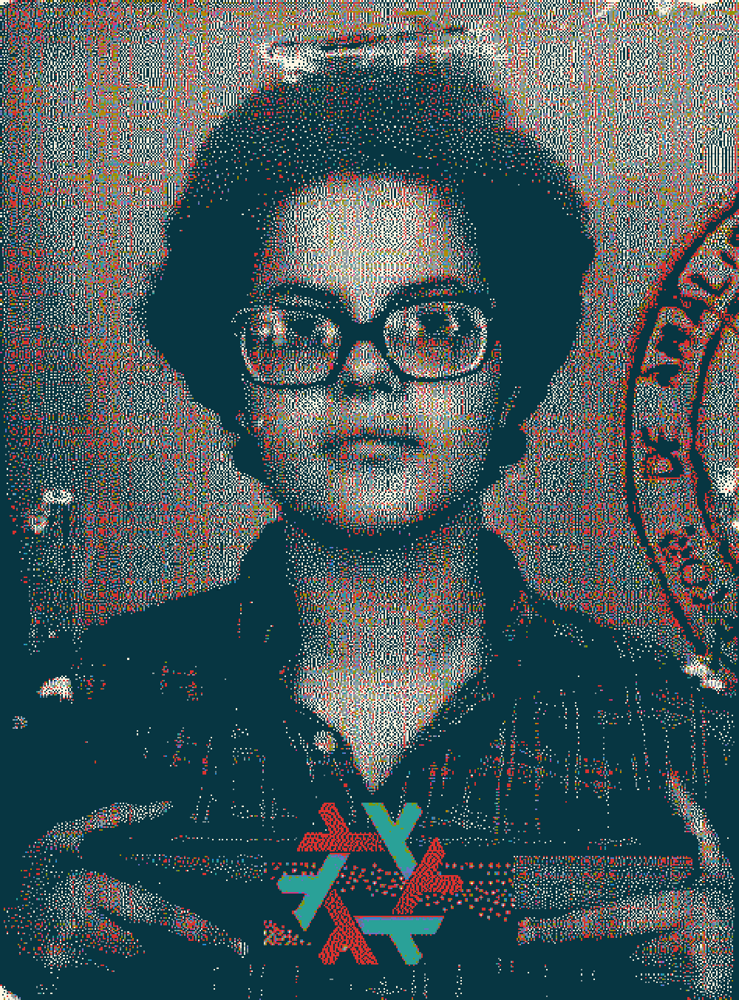

# Открытый Код

---

## I.

Сигнал поступил в 23:52. Капитан Браганса прочитал дважды.

**ПОДРЫВНАЯ ДЕЯТЕЛЬНОСТЬ — НЕСАНКЦИОНИРОВАННАЯ ОПЕРАЦИОННАЯ СИСТЕМА — ПОРТУ-АЛЕГРИ**

— Что такое NixOS? — спросил он.

У рядового Фуэнтеса была карточка. Карточка была всегда.

— Операционная система, товарищ капитан. Исходный код открыт. Любой гражданин может прочитать внутреннее устройство машины.

Браганса смотрел на слово *внутреннее*.

— Арестовать, — сказал он.

---

## II.

Дилма прибыла в два часа ночи и спросила, где розетка.

Браганса не ответил. Бросил на стол листок — фотографию терминала, напечатанную на копировальной бумаге техником, который провёл сорок минут, пытаясь понять, что он видит.

— Вы использовали NixOS.

— Использую, — поправила она.

— *Использовали.* — Браганса указал на стул. — Садитесь.

Она села. Посмотрела на фотографию с выражением человека, проверяющего список покупок.

— Здесь неверная конфигурация, — сказала она, указывая пальцем. — Этот пакет не должен быть здесь.

Фуэнтес записал. Не зная зачем. Рефлекс.

— Гражданка Руссефф, — начал Браганса снова, медленно, как будто разговаривал с человеком, не понимающим языка. — Господин президент не санкционирует использование систем, внутреннее устройство которых доступно широкой общественности. Открытый код — это уязвимость.

— Для кого?

— Для страны.

Дилма обдумала это секунду.

— Страна не умеет компилировать ядро.

— Это не— — Браганса остановился. Начал снова. — Проблема не техническая.

— Все проблемы технические.

Фуэнтес перестал писать.

Браганса встал, подошёл к окну, вернулся. Это была процедура, которую он применял, когда нужно было упорядочить мысли. Обычно помогало.

— Вы обвиняетесь в подрывной деятельности.

— На каком основании?

— На основании системы, которую вы используете.

— Которая является операционной системой.

— Которая *открыта*. — Браганса ударил ладонью по столу — не сильно, скорее как знак препинания. — Любой может видеть, что внутри. Это опасно.

— Товарищ капитан, — сказала Дилма, — вы когда-нибудь разбирали радио?

Тишина.

— Чтобы посмотреть, как работает, — продолжила она. — Любой может разобрать радио. Радио от этого не становится подрывным.

— Радио не обрабатывает информацию.

— Этот аргумент не выдерживает критики.

— Ему не нужно выдерживать критику. — Браганса сел. — Ему нужна подпись.

Фуэнтес принёс бумагу. Браганса подписал, не читая. Это был бланк превентивного задержания с пустой графой для указания причины. Фуэнтес написал *использование технологии, несовместимой с действующим порядком* и остался доволен точностью формулировки.

Они оставили её в комнате.

Дилма несколько минут смотрела в потолок. Потом попросила у агента за дверью бумагу и карандаш. Он принёс. Она начала писать.

Агент спросил, что это.

— Документация, — сказала она.

Он больше ничего не спрашивал.

---

## III.

Утром третьего дня Фуэнтес вошёл в комнату с выражением лица, которое Браганса не хотел видеть.

— IBM завис.

IBM System/360 был единственным компьютером в здании. Все карточки, все рапорты, вся работа за последние недели — всё было внутри.

— Позовите техника.

— Техник говорит, что это операционная система.

— Тогда установите другую.

— Техник говорит, что не умеет устанавливать другую.

Браганса помолчал довольно долго.

— Она умеет, — сказал Фуэнтес.

— Нет.

— Товарищ капитан—

— Нет.

Фуэнтес ждал.

— Сколько ей понадобится времени? — наконец спросил Браганса.

— Она сказала — десять минут.

Ушло семь. Браганса смотрел на часы, когда она вышла из машинного зала и вернула карандаш агенту в коридоре.

— Работает, — сказала она.

— Что вы сделали? — спросил Фуэнтес.

— Исправила проблему.

— В чём была проблема?

— В предыдущей системе.

Фуэнтес записал. Браганса больше ничего не спрашивал — в нём была часть, которая не хотела знать ответа, и эта часть побеждала.

---

## IV.

Процесс занял один день.

У обвинителя было три улики: фотография терминала, показания Фуэнтеса и дискета, которую никто не смог открыть. Адвокат защиты утверждал, что ни одна из них не является преступлением. Обвинитель утверждал, что являются. Судья слушал с видом человека, у которого болит голова со времени обеда.

— Обвинение, — сказал судья наконец, — состоит в использовании операционной системы, не утверждённой Вооружёнными силами.

— Такого утверждения не существует, — сказал адвокат.

— Будет существовать, — сказал обвинитель.

— Но пока не существует.

Судья посмотрел на Дилму. Она смотрела в окно.

— Гражданка Руссефф. Вам есть что заявить?

— Дискета отформатирована в ext2, — сказала она, не отрывая взгляда от окна. — Если хотите открыть — открою.

Судья опустил очки.

— Это имеет отношение к делу?

— Не знаю. Зависит от того, что внутри.

Пауза.

— Дело, — сказал судья, — закрыто ввиду недостаточности материальных доказательств. — Он ударил молотком. Повернулся к секретарю. Понизил голос. — Поговори с ней насчёт компьютера в моём кабинете. Завис уже две недели.

---

*Это художественный вымысел. Дилма Руссефф была арестована и подверглась пыткам в период бразильской военной диктатуры — это исторический факт, а не предмет для шуток. NixOS создан в 2003 году.*
